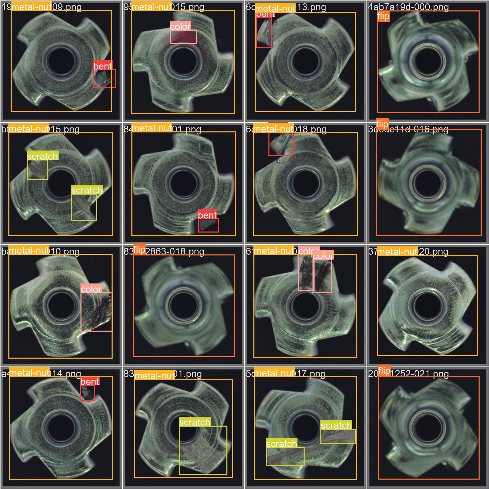
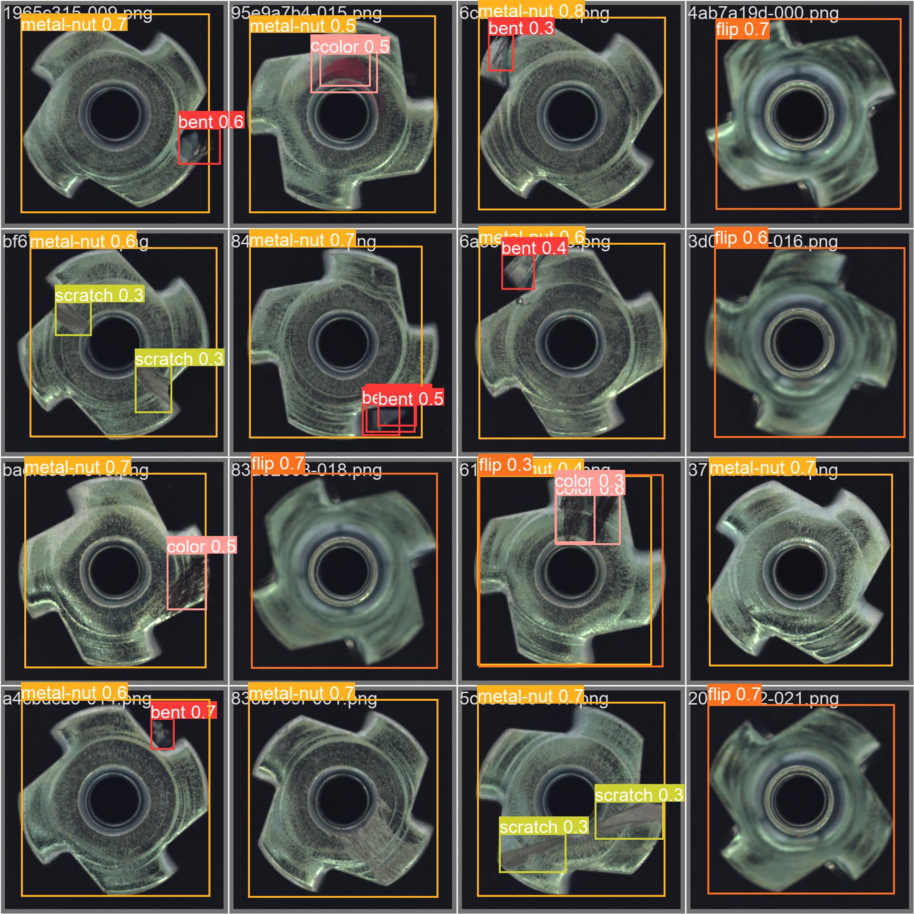

# Defects detection in metal nuts by using vision IA multi-label object detection

## Autor: Rodrigo Gonzalez

## Introduction

The primary objective of this project is to utilize a YOLOv5 convolutional neural network to identify flaws in metal nuts. The dataset used for training and evaluation purposes is the [The MVTec Anomaly Detection Dataset (MVTec AD)](https://www.mvtec.com/company/research/datasets/mvtec-ad), which consists of nearly 30 images per defect category. Given that convolutional neural networks require a significant amount of data to train effectively, this project aims to investigate whether 30 images per class are sufficient to train a YOLOv5 network and achieve satisfactory results.

To facilitate the training process, the metal nut images have been labeled for YOLOv5, and both the images and labels are available in the `data/metal_nut_org folder`.

### YOLOv5 Docker

A Docker image is used to implement a YOLOv5. It can be downloaded from 

[https://hub.docker.com/r/ultralytics/yolov5](https://hub.docker.com/r/ultralytics/yolov5).

A YOLOv5 container is run with the following command:

```
$ docker run --ipc=host -it --gpus all -v /home/rodralez/metal_nut:/usr/src/metal_nut ultralytics/yolov5:latest
```

## Training


The training step is controlled by the Python script `code/python/metal_nut_yolov5_train.py`. A cross-validation approach is implemented to train the system. Several training and validation datasets are created randomly sampling images from the  `data/metal_nut_org` folder.

Once the YOLOv5 container is running, the  Python script has to be copied to the Docker container and runned,

```
/usr/src/app# cp ../metal_nut/code/python/metal_nut_yolov5_train.py . && python3 metal_nut_yolov5_train.py
```

## Validation

The validation step is implemented with

```
/usr/src/app# cp ../metal_nut/code/python/metal_nut_yolov5_train.py . && python3 metal_nut_yolov5_train.py
```

## Conclusion

On average, the mAP50 is 0.374 for 10 cross validation experiments. For some experiments, the system reachs mAP50 0.75, as shown in the following images.


 
True images
 


Predicted images 
