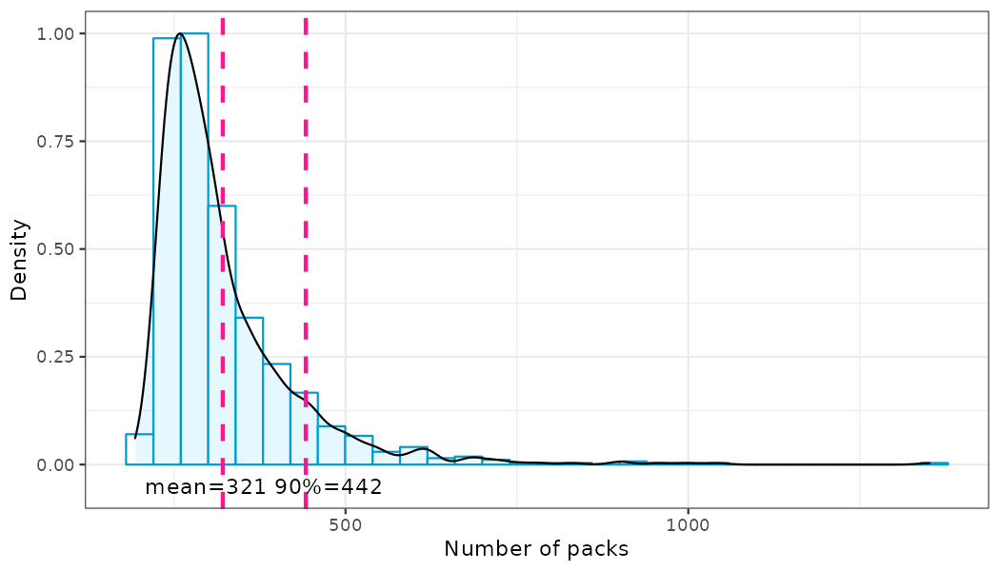
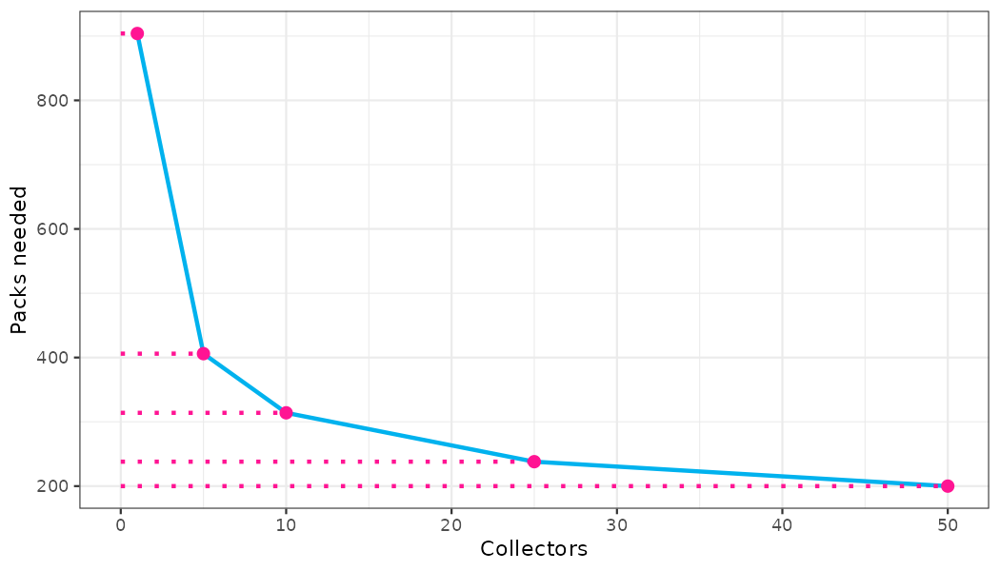
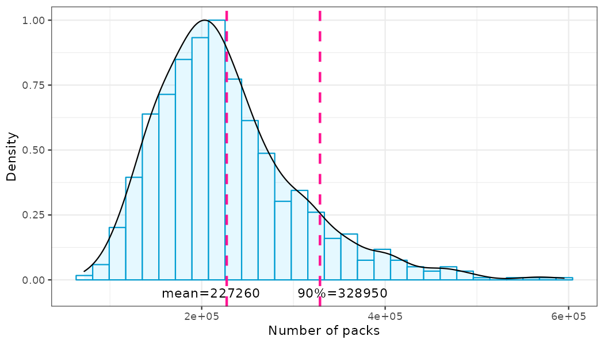

# The Panini collector problem

## How many packs have to be purchased to complete the Panini FIFA World Cup Qatar 2022 album?

## Authors Rodrigo Gonzalez and Carlos A. Catania

**Reading time: 10 minute(s) @ 200 WPM.**

Every 4 years the madness starts all over again: it is time to complete a new Panini album for the FIFA World Cup. This year is not an exception and the Panini company has released a new album with **638 stickers** to collect due to the FIFA World Cup Qatar 2022. Let the **Paninimania** begin!

The Panini Qatar 2022 collection also includes **20 extra stickers** featuring 14 legendary players and 6 rookie players. These unnumbered stickers are not part of the main album. Extra stickers are really hard to collect: on average 1 extra sticker can be found in 100 packs, according to the information provided at the Panini website. 

An ancient question asked by all mankind is *how many packs do I have to buy to complete the Panini album?*. In an effort to bringing some relief to humanity, we have developed a **web application** where you can estimate how many Panini packs you have to buy based on your own situation: number of unique stickers that you have already collected, number of friends you are swapping stickers with, and the price of a Panini pack in your country. You can try this <a href="https://model01.ingenieria.uncuyo.edu.ar/panini-app/" target="_blank">web app here</a>.

The rest of this report will be dedicated to expose *what is under the hood* of this web app. 

The <a href="https://en.wikipedia.org/wiki/Coupon_collector%27s_problem" target="_blank">Coupon Collector Problem</a> is a mathematical framework to estimate how many coupons have to be collected to win a prize from, for example, an on-pack cereal promotion. At first sight, the Coupon Collector Problem theory can be used to know the number of missing packs to complete a Panini album, but it is not exactly the same problem. When trying to complete a Panini album, collectors must gather `r CS` stickers by getting 5 different stickers randomly when purchasing 1 pack. Panini guarantees that stickers inside a pack are not duplicated. Additionally, Panini collectors can cooperate and swap duplicated stickers. This is a very common practice. Because of these particularities, this problem is usually called the **Panini Collector Problem** (PCP).

So, two strategies can be addressed to complete the Panini album:

1. Collecting stickers alone without swapping stickers with other collectors.
2. Collecting stickers and cooperating with other collectors to complete the album, a more common approach.

We will evaluate these two scenarios to shed some light to which is the best strategy.

Additionally, we want to test the impact of the 20 extra stickers in completing the Panini collection, album plus extra stickers. 

All the code developed for this report can be found at <a href="https://github.com/rodralez/ds-portfolio" target="_blank">this link</a>.

## No swapping strategy

### Approximate solution to the Panini Collector Problem for the no-swapping strategy

The number of stickers needed to complete a Panini album can be estimated by the following formula. A very nice explanation of where this formula comes from can be found at [ref. 1](#CCP),

$$stickers \approx n \cdot (ln(n) + 0.577)$$

where *ln* is the natural logarithm and *n* is the number of stickers to collect. In the case of the Panini Qatar 2022 album, *n* is equal to 638. So, the number of packs is,

$$packs \approx stickers  \div 5$$

The approximate solution tell us that on average **898** packs are needed to complete the album. Considering that the price of 1 pack with 5 stickers is about USD 1.25, as stated at [ref. 3](#fortune), **USD 1,122** are needed to cover the cost of completing the album.
      
### Simulation approximation for the no-swapping strategy

Although we can use the approximate solution to estimate the number of packs that have to be purchased, we want to try another approach to solve this problem that will be useful later. Next, we will estimate the number of packs needed on average to complete the Panini album by generating 1000 Monte Carlo simulations. A Monte Carlo simulation is a mathematical technique which is used to estimate the possible outcomes of an uncertain event.

Figure 1 shows the statistical distribution, or more formally the probability density, of the number of packs needed to complete a Panini album without swapping. The distribution is right-skewed with a long right tail. According to 1000 Monte Carlo simulations, on average **888 packs** are needed to complete the album, or **USD 1,110**. This value is pretty close to the one found by the previous formula. Considering a 90% probability, which means that it is very likely that you will need to buy *N* packs at most to complete the album, this number increases to **1096 packs** or **USD 1,370**, a little fortune for the average child.

Fig. 1: Probability density of the number of packs needed to complete a Panini album  without swapping with other collectors (1000 simulations).

## Swapping strategy

### Simulation approximation for the swapping strategy

Even though some formulations have been proposed for the Coupon Collector Problem with swapping, these formulas are very hard to solve for large numbers of stickers and collectors. So, our approach to solve the PCP with swapping will be by using Monte Carlo simulations.

Several assumptions are hold for the Monte Carlo simulations when collecting with swapping:

1. All stickers have equal probability to show up in a pack (no planned shortage of particular stickers), or more formally, stickers are drawn from an uniform distribution.
2. All collectors start collecting at the same time.
3. All collectors buy 1 new pack at the same time.
4. After buying a new pack, collectors fill their albums. Duplicated stickers go to the individual collector's sticker swap stack.
5. Then, a round of sticker swapping starts. Although every collector can swap with any other collectors, the sticker swapping is between two collectors at a time.
6. At each round collectors are ordered randomly and they search for missing stickers at other collectors' swap stacks in turns, starting for the first collector in the queue.
7. If two collectors can swap stickers, only the minimum number of needed stickers can be interchanged between collectors. For example, if the first collector in the queue can offer 2 stickers and the second collector in the queue can offer 3 stickers, only 2 stickers can be swapped by both collectors. Then, the first collector in the queue keeps looking for missing stickers at the swap stack of the third collector in the queue, and so on.

Figure 2 shows the probability density of the number of packs needed to complete a Panini album when cooperating with other **10 collectors**. The distribution is right-skewed again. But the good news is that in this case on average **315** packs are needed to complete the album, or **USD 394**, a third of the money when compared to the no-swapping strategy. And considering a 90% probability, this number drops to **429** packs needed or **USD 536**. This is **Panini-ntastic**!

Fig. 2: Probability density of the number of packs needed to complete a Panini album  when swapping with 10 collectors (1000 simulations).

### Number of collectors versus number of packs

It is interesting to evaluate the relationship between the number of collaborators swapping stickers and the number of packs that a particular collector has to purchase to complete the Panini album.

Figure 3 shows this relationship for 1, 5, 10, 25 and 50 collectors, where 1 collector is the same case as for no-swapping strategy. It can be seen that the relationship is asymptotic, which means that swapping with more collectors is good, but past a certain point it almost makes no difference to swap stickers with additional collectors.

Fig. 3: Number of collectors vs. packs needed to complete the Panini album (1000 simulations).

<!-- ======================================================================= -->

## Extra stickers

We all have heard about the *conspiracy theory* that every Panini album has rare stickers which are harder to collect. Typically, these stickers are linked to football stars such as Lionel Messi or Cristiano Ronaldo. This planned shortage of some stickers by Panini has not been proved so far. In fact, in a paper by Sardy and Velenik (see [ref. 4](#Sardy)) it is shown that even if 10 friends buy 100 packets each and perform optimal swapping, one sticker will be still missing to all these 10 collectors slightly more than 25% of the time. And they have collectively purchased 5000 stickers!. This means that some stickers could be perceived as rarer than others.

However, Panini does offer 20 rare stickers to collect known as **extra stickers**. Panini reports at its website that these extra stickers are randomly inserted, on average, in every 100 packets, so they are actually harder to collect. No hidden catch here. These stickers are not part of the album, so one can complete the album even without getting one of these rare collectible stickers. Anyway, we want to test what happens with the number of packs needed when the goal is both to complete the Panini album and to collect these extra stickers. 

For the extra stickers simulations we consider that:

1. The total collection of regular stickers is 638.
2. The total collection of extra stickers is 20.
3. The probability of drawing 1 common sticker is $pc = 1/638$. 
4. The probability of drawing 1 extra sticker is $px = pc/500$.

Next, we will repeat the Monte Carlo simulations with extra stickers only for the no-swapping, because most of the people is not going to swap a rare sticker for just a common sticker, not even 200 stickers!.

### Simulation approximation for the no-swapping strategy with extra stickers

Figure 4 shows the probability density of the number of packs needed to complete a Panini album with 20 extra stickers without swapping. We can see that the average number of packs increases from 888 to an astonishing amount of **225,583 packs**  or **USD 281,979**, if extra stickers want to be collected. In other words, you can collect Panini rare stickers or buy a Lamborghini. Insane. 

Fig. 4: Probability density of number of packs needed to complete a Panini album  with 20 extra stickers and without swapping (1000 simulations).

<!-- ======================================================================= -->

## Conclusions

Clearly, the best strategy to complete the Panini Qatar 2022 album is to swap stickers with other collectors, the more collectors the better to some extent. Even if you trade stickers with 4 people only, the number of packs to complete the album drops to 400 (see Fig. 3), which is less than half of packs needed when compared to collecting alone. Finally, collecting extra stickers is really hard and has a strong impact on the number of packs that have to be purchased. It seems that a better approach is “cheating” and buying these rare stickers directly online.

<!-- ======================================================================= -->

## References

1.  Andy Hayes and Geoff Pilling. Coupon Collector Problem. Accessed on September 2022, [link](https://brilliant.org/wiki/coupon-collector-problem/). 

2.  Delmarcelle, O., & Vrins, F. (2019). The Panini collector’s problem: optimal strategy and trading analysis (Doctoral dissertation, Master thesis), [pdf](https://dial.uclouvain.be/downloader/downloader.php?pid=thesis%3A20994&datastream=PDF_01).

3.  Fortune Magazine. Inflation hits one of soccer fans’ favorite pastimes as filling the World Cup Panini sticker album will cost over $1,000, [link](https://fortune.com/2022/08/30/world-cup-soccer-inflation-panini-sticker-album-fifa/).

4.  Sardy, S., & Velenik, Y. (2010). Paninimania: sticker rarity and cost-effective strategy. Swiss Statistical Society, 2-6, [pdf](https://www.unige.ch/math/folks/velenik/Vulg/Paninimania.pdf).

 
 
 
