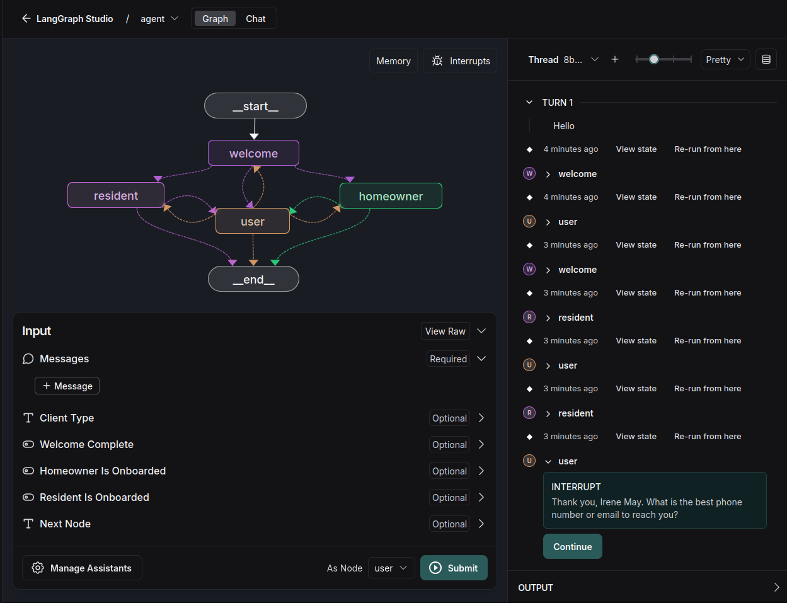

# Renting Chatbot

An intelligent conversational agent designed to automate property management interactions for both homeowners and residents.

## Overview

This chatbot system handles two primary user flows:
1. **Homeowner Onboarding** - Collects property information and schedules inspections
2. **Resident Matching** - Helps renters find suitable properties and schedule tours

The system uses LangGraph and LangChain to create a conversational flow with specialized agents for different user types.

## Architecture

The chatbot operates through a state machine with four primary nodes:

1. **Welcome Agent** - Determines if the user is a homeowner or a resident
2. **Homeowner Agent** - Handles property onboarding for homeowners
3. **Resident Agent** - Facilitates property searching and tours for residents
4. **User Node** - Collects user input and routes to appropriate agent nodes



## Flow Diagram

The system works by:

1. Starting with the Welcome Agent to classify the user
2. Based on classification, routing to either the Homeowner or Resident Agent
3. Capturing relevant information through structured conversations
4. The User Node handles transitions between states and collects user input
5. Triggering appropriate actions (scheduling inspections, property tours, etc.)

## Agents

### Welcome Agent
- Determines user type (homeowner/resident)
- Maintains conversation until classification is complete

### Homeowner Agent
- Collects property information: address, vacancy status, utilities status
- Schedules property inspections when conditions are met
- Notifies internal staff about scheduled inspections

### Resident Agent
- Gathers rental preferences: bedrooms, bathrooms, location, budget
- Searches available properties matching criteria
- Schedules property tours
- Notifies staff about scheduled tours

### User Node
- Collects and processes user input
- Routes conversations to appropriate agent nodes based on the state
- Manages conversation flow between different specialized agents
- Handles interrupts for interactive user sessions

## Tools

The system integrates several tools:
- `schedule_a_meeting` - For homeowner inspection scheduling
- `schedule_tour` - For resident property tour scheduling
- `trigger_communication` - For notifying staff about scheduled events
- `fetch_listings` - For finding properties matching resident criteria

## Requirements

- Python 3.11+
- LangGraph
- LangChain
- OpenAI API key (or other LLM provider)
- Loguru (for logging)
- LangSmith API key

## Setup and Installation

1. Clone the repository and navigate to the project directory:

```bash
git clone https://github.com/rodralez/ai-portfolio.git
cd ai-portfolio/renting-chatbot
```

2. Create and activate a virtual environment:

```bash
python3.11 -m venv .venv
source .venv/bin/activate  # On Windows: .venv\Scripts\activate
```

3. Install the dependencies:

```bash
pip install --upgrade pip
pip install -r requirements.txt
```

4. Install development dependencies (optional):

```bash
pip install -e ".[dev]"
```

## Configuration

1. Create the `.env` file by copying the example:

```bash
cp .env.example .env
```

2. Configure the necessary environment variables:

```
# .env file
OPENAI_API_KEY=your_openai_api_key
OPENAI_MODEL=gpt-4-0125-preview  # Or other suitable model
COMPANY_NAME="Your Property Management Company"
```

3. Model Configuration:

The chatbot uses the Configuration class in `src/renting_chatbot/configuration.py` which allows you to customize:
- The AI model to use
- Recursion limits for the agent
- Other runtime parameters

## Deployment

### Local Development

Launch the system in LangGraph Studio for local development and testing in Ubuntu:

```bash
uvx --refresh --from "langgraph-cli[inmem]" --with-editable . --python 3.11 langgraph dev
```

This will start the development server at http://localhost:2024.


## Usage

Once deployed, you can interact with the chatbot through:

1. REST API endpoints
2. LangGraph UI (for development)
3. Integration with your property management website or mobile app